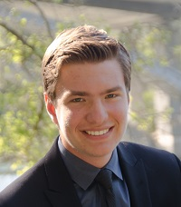

I work with C-style languages, using C# and Unity for my work in the Evolutionary Computational Systems Labratory and other side projects, C++ for all course work, completed Data Structures and currently in Programming Languages, and C for my teaching fellow position. I am familar with other web languages from side projects including SQL and frontend and backend Javascript frameworks.

## Links

Github: [kylebrain](https://github.com/kylebrain)  
Email: [kbrainard@nevada.unr.edu](mailto:kbrainard@nevada.unr.edu)  
ECSL Website: [here](https://ecsl.cse.unr.edu/)  
Resume: [here](https://docs.google.com/document/d/1uqIqqzies9qAt4caEGX0H8eLjIEw2-p1FyB1GzM2Y2k/edit?usp=sharing)
